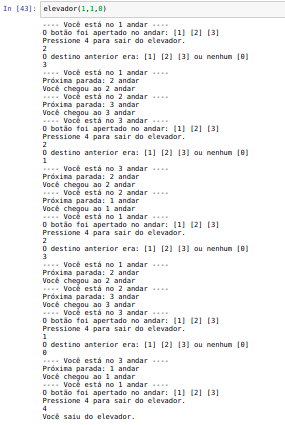
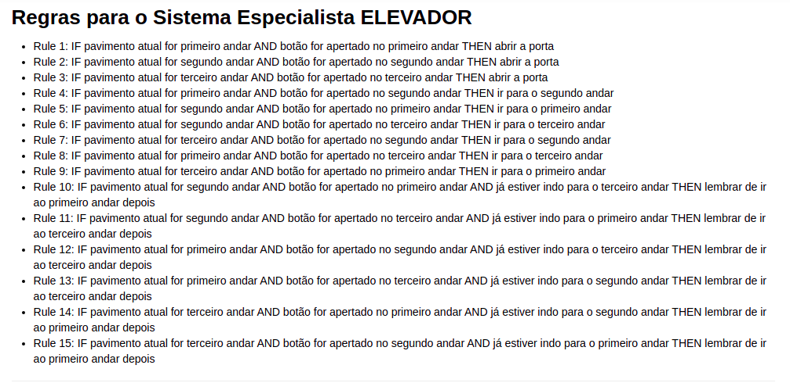

<h2 align = center> Atividade 9 - Tarefa Final Primeiro Bimestre </h2>

Professores: Evandro de Barros Costa e Giseldo da Silva Neo

Alunos:

- <a href="https://github.com/hglps">Hiago Lopes Cavalcante</a>
- <a href="https://github.com/JohnQ00">John Davi Dutra Canuto Pires</a>
- <a href="https://github.com/ferreiraluana">Luana Júlia Nunes Ferreira</a>

<h2 align = center> Atividade 1 </h2>
<h3 align = center> Refazer o sistema especialista dinossauro </h3>

### 1. Captura de tela da base de dados

    

### 2. Captura de tela de um fluxo de execução do sistema

    

<h2 align = center> Atividade 2 </h2>
<h3 align = center> Sistema Especialista Dinossauro </h3>

# Regras para o Sistema Especialista ELEVADOR
- Rule 1: IF pavimento atual for primeiro andar AND botão for apertado no primeiro andar THEN abrir a porta
- Rule 2: IF pavimento atual for segundo andar AND botão for apertado no segundo andar THEN abrir a porta
- Rule 3: IF pavimento atual for terceiro andar AND botão for apertado no terceiro andar THEN abrir a porta
- Rule 4: IF pavimento atual for primeiro andar AND botão for apertado no segundo andar THEN ir para o segundo andar
- Rule 5: IF pavimento atual for segundo andar AND botão for apertado no primeiro andar THEN ir para o primeiro andar
- Rule 6: IF pavimento atual for segundo andar AND botão for apertado no terceiro andar THEN ir para o terceiro andar
- Rule 7: IF pavimento atual for terceiro andar AND botão for apertado no segundo andar THEN ir para o segundo andar
- Rule 8: IF pavimento atual for primeiro andar AND botão for apertado no terceiro andar THEN ir para o terceiro andar
- Rule 9: IF pavimento atual for terceiro andar AND botão for apertado no primeiro andar THEN ir para o primeiro andar
- Rule 10: IF pavimento atual for segundo andar AND botão for apertado no primeiro andar AND já estiver indo para o terceiro andar THEN lembrar de ir ao primeiro andar depois
- Rule 11: IF pavimento atual for segundo andar AND botão for apertado no terceiro andar AND já estiver indo para o primeiro andar THEN lembrar de ir ao terceiro andar depois
- Rule 12: IF pavimento atual for primeiro andar AND botão for apertado no segundo andar AND já estiver indo para o terceiro andar THEN lembrar de ir ao terceiro andar depois
- Rule 13: IF pavimento atual for primeiro andar AND botão for apertado no terceiro andar AND já estiver indo para o segundo andar THEN lembrar de ir ao terceiro andar depois
- Rule 14: IF pavimento atual for terceiro andar AND botão for apertado no primeiro andar AND já estiver indo para o segundo andar THEN lembrar de ir ao primeiro andar depois
- Rule 15: IF pavimento atual for terceiro andar AND botão for apertado no segundo andar AND já estiver indo para o primeiro andar THEN lembrar de ir ao primeiro andar depois

------------------------------------------------------------------------------------------------------------------------------------------------------------------
# Print da Execução do Sistema

    

    

------------------------------------------------------------------------------------------------------------------------------------------------------------------
<h2 align = center> Atividade 3 </h2>
<h3 align = center> Sistema especialista baseado em regras, o que é o algoritmo Rete e seu funcionamento. </h3>
<h3> Link para o documento: </h3> <a href="https://docs.google.com/document/d/1gtPcK_ztY60sApZo9JdeUZlTfGXah2IR29BZfy9N3kY/edit?usp=sharing">Doc aqui (email institucional)</a> 
